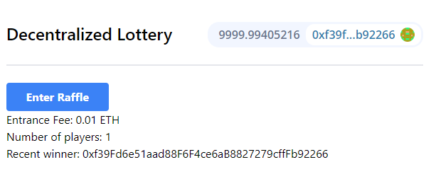

## Getting Started

### Prerequisites

```bash
npm i npm@latest -g
npx create-next-app@latest --typescript .
```

### Installation

```bash
npm i moralis react-moralis
npm i web3uikit

npm i -D tailwindcss postcss autoprefixer
npx tailwindcss init -p
```

## Resources

Moralis
* https://docs.moralis.io/moralis-dapp/connect-the-sdk/connect-with-react
* https://www.npmjs.com/package/react-moralis
* https://github.com/MoralisWeb3/react-moralis


Web3UIKit!
* https://github.com/web3ui/web3uikit

ABI -- Converting Between Formats
* https://docs.ethers.io/v5/api/utils/abi/formats/#abi-formats--converting-between-formats

Install Tailwind CSS with Next.js
* https://tailwindcss.com/docs/guides/nextjs

IPFS Desktop for Windows
* https://docs.ipfs.io/install/ipfs-desktop/#windows

How to deploy a Next.js app onto IPFS using Fleek
* https://blog.fleek.co/posts/fleek-nextJS

# Usage
1. Run node
```shell
# Update constants
hh deploy

# Run node
hh node

# Pick a winner
hh run scripts/mockOffchain.ts --network localhost
```
## Useful commands

# Build and deploy

## Manual deploy to IPFS

```shell
npm run build
npm run export
# Export successful. Files written to C:\Projects\solidity-patrick-lottery-nextjs\out
```
Then 
* Import folder `output` to IPFS
* Set spinning folder `output`
* Copy CID
* Goto browser: ipfs.ip/ipfs/QmfTDb2UmmNth2LL5gHynVm8K88QUGk4jTia27r81ewcat

## Deploy with Fleek

### Settings

https://app.fleek.co/#/sites/raffle-dmi/settings/general?accountId=542c44fa-2ce0-4cd5-9b8a-ea8c413ed2c4

Build command:
```shell
npm install && npm run build && npm run export
```

### Result

* https://raffle-dmi.on.fleek.co
* https://ipfs.co/ipfs/QmXAczmXRG4jmHCbs3d5d1UQdNJDzjyX8MgU5nts1Q5w8z
